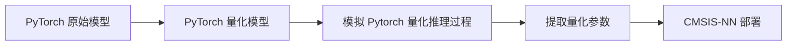

# CMSIS-NN 量化参数提取

### 简介

本项目用于从 **PyTorch** 神经网络模型提取量化参数，以满足 **CMSIS-NN** 推理时的要求，实现模型在 pytorch 和 CMSIS-NN 上的效果对齐

### 功能特性

| 功能           | 是/否实现 | 备注        |
| -------------- | --------- | ----------- |
| 全连接层（FC） | ✅         | 2层全连接层 |
| 卷积层（Conv） |           | LeNet       |
| ReLU           | ✅         |             |
| ==TODO==       |           |             |

### 文件构成

| 文件夹              | 描述                   | 备注       |
| ------------------- | ---------------------- | ---------- |
| `CMSIS_NN_function` | 模拟 CMSIS-NN 量化推理 |            |
| `dataset`           | mnist 数据集相关       |            |
| `eval`              | 评估模型               |            |
| `models`            | 模型、量化模型         | torch      |
| `old_file`          | 走过的弯路，用于总结   |            |
| `parameter`         | 模型参数               | 原始、量化 |
| `test`              |                        |            |
| `train`             | 训练、参数             |            |
| `utils`             | 未明确分类的功能       |            |

`train_FCnet.py`：模型训练，获取原始参数

`torch_version.py`：模拟  Pytorch 量化模型推理

`arm_version.py`：模拟 CMSIS-NN 推理

### 依赖

+ Python 3.8+
+ torch  2.5.1
+ torchvision 0.20.1
+ MNIST
+ CMSIS-NN Library

### TODO

- [ ]  支持更多层类型（目前仅支持 Linear）
- [ ]  支持 per-channel weight quantization

---

