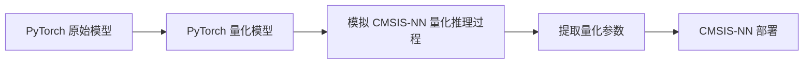

# CMSIS-NN 量化参数提取

### 简介

本项目用于从 **PyTorch** 神经网络模型提取量化参数，以满足 **CMSIS-NN** 推理时的要求，来观察模型在 pytorch 和 CMSIS-NN 上的效果是否对齐



### 依赖

+ Python 3.8+
  + torch  2.5.1
  + torchvision 0.20.1
+ MNIST

### 目录结构

+ [`CMSIS_NN_simulator`]()：CMSIS-NN 神经网络算子模拟
+ [`dataset`]()：储存 MNIST 数据集
+ [`doc`]()：一些相关文档
+ [`eval`]()：模型评估
+ [`models`]()：Pytorch 模型、量化模型
+ [`parameter`]()：储存模型参数（运行后生成）
+ [`train`]()：模型训练函数、训练参数
+ [`utils`]()：一些常用功能

### 功能特性

| 功能            | 是/否实现 | 备注                           |
| --------------- | --------- | ------------------------------ |
| 全连接（FC）    | ✅         |                                |
| 卷积（Conv）    | ✅         | 存在细微误差；未实验逐通道量化 |
| 池化（pooling） | ✅         |                                |
| ReLU            | ✅         |                                |
| LSTM            |           |                                |
| ==TODO==        |           |                                |

>  *Note*：“实现” 指的是已确认该功能在 **CMSIS-NN 推理** 和 **Torch 量化推理** 可对齐

### 如何使用

1. 训练：模型参数将以原始格式保存在 `./parameter/xxx.pt` 文件中。

```powershell
python xxx_train.py
```

2. 推理：
   1. 获取准确率： 1）torch原始模型；2）torch量化模型；3）模拟CMSIS-NN模型
   2. 导出 CMSIS-NN 推理所需参数


```powershell
python xxx_cmsisnn.py
```


---

### 参考资料

+ [PyTorch documentation](https://docs.pytorch.org/docs/stable/index.html)

+ [CMSIS NN Software Library](https://arm-software.github.io/CMSIS_6/latest/NN/index.html)

+ [Awesome Compression - github](https://github.com/datawhalechina/awesome-compression?tab=readme-ov-file)
